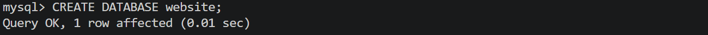
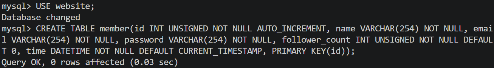
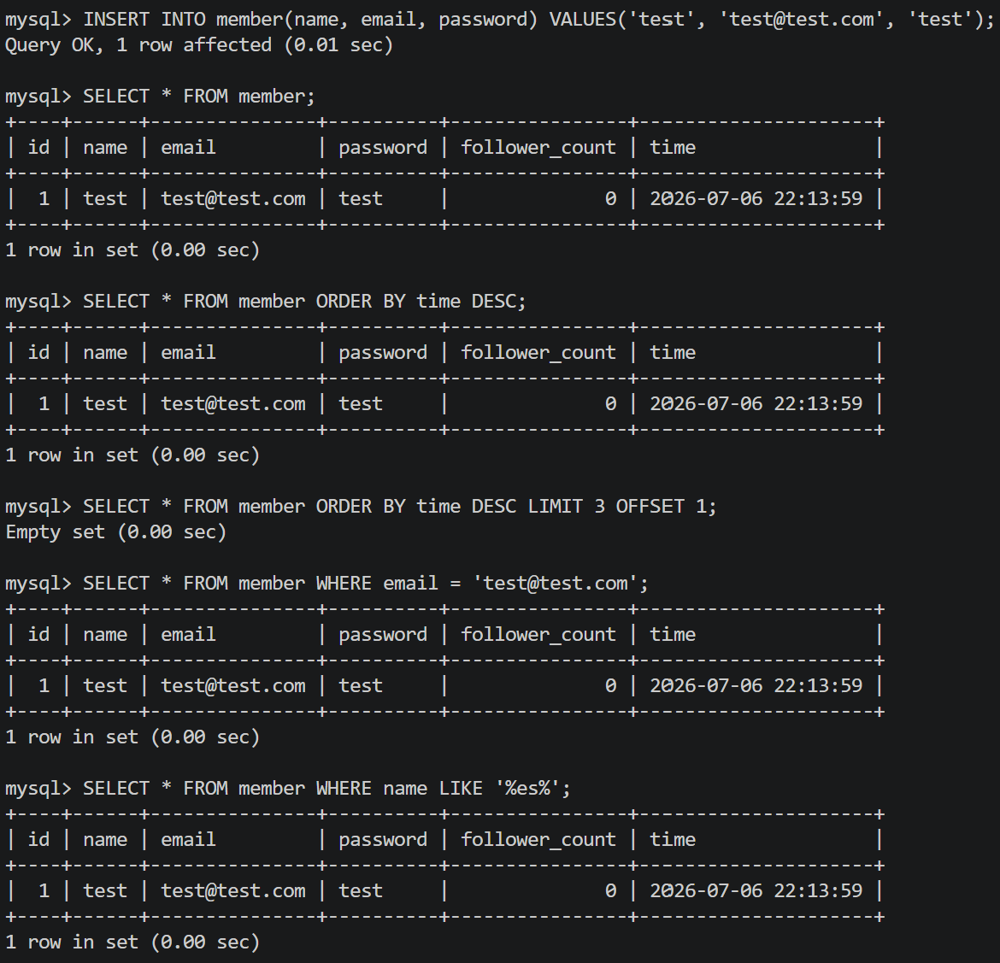
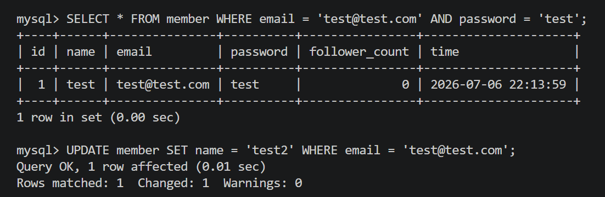
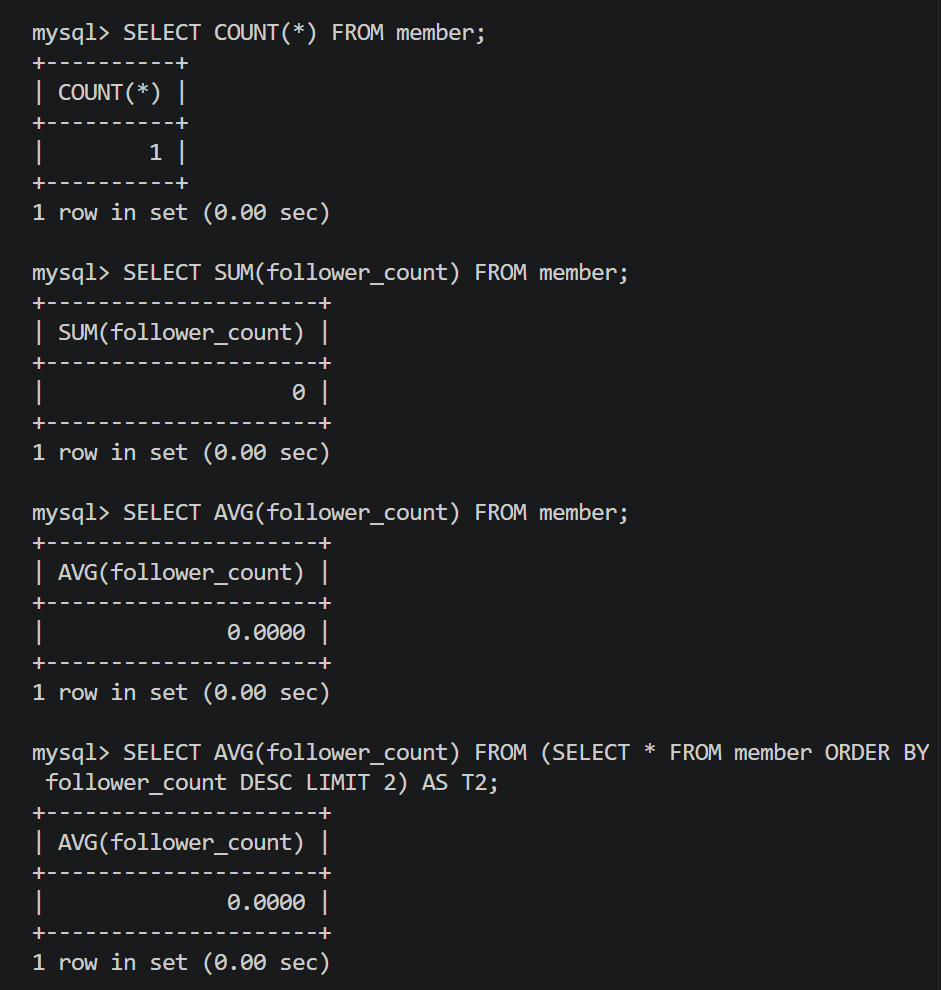
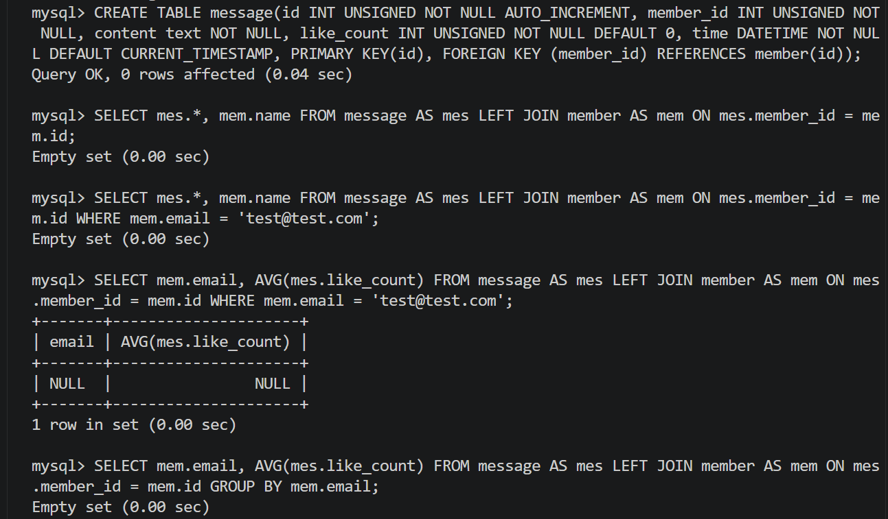

# Week5 Assignment

## Task 2

**SQL：**

\`\`\`sql
CREATE DATABASE website;

CREATE TABLE member(
  id INT UNSIGNED NOT NULL AUTO_INCREMENT, 
  name VARCHAR(254) NOT NULL, 
  email VARCHAR(254) NOT NULL, 
  password VARCHAR(254) NOT NULL, 
  follower_count INT UNSIGNED NOT NULL DEFAULT 0, 
  time DATETIME NOT NULL DEFAULT CURRENT_TIMESTAMP, 
  PRIMARY KEY(id)
);
\`\`\`

**Screenshots：**

---

## Task 3

**SQL：**

\`\`\`sql
INSERT INTO member(name, email, password) VALUES('test', 'test@test.com', 'test');

SELECT * FROM member;

SELECT * FROM member ORDER BY time DESC;

SELECT * FROM member ORDER BY time DESC LIMIT 3 OFFSET 1;

SELECT * FROM member WHERE email = 'test@test.com';

SELECT * FROM member WHERE name LIKE '%es%';

SELECT * FROM member WHERE email = 'test@test.com' AND password = 'test';

UPDATE member SET name = 'test2' WHERE email = 'test@test.com';
\`\`\`

**Screenshots：：**

---

## Task 4

**SQL：**

\`\`\`sql
SELECT COUNT(*) FROM member;

SELECT SUM(follower_count) FROM member;

SELECT AVG(follower_count) FROM member;

SELECT AVG(follower_count) FROM (SELECT * FROM member ORDER BY follower_count DESC LIMIT 2) AS T2;
\`\`\`

**Screenshots：**

---

## Task 5

**SQL：**

\`\`\`sql
CREATE TABLE message(
  id INT UNSIGNED NOT NULL AUTO_INCREMENT, 
  member_id INT UNSIGNED NOT NULL, 
  content text NOT NULL, 
  like_count INT UNSIGNED NOT NULL DEFAULT 0, 
  time DATETIME NOT NULL DEFAULT CURRENT_TIMESTAMP, 
  PRIMARY KEY(id), 
  FOREIGN KEY (member_id) REFERENCES member(id)
);

SELECT mes.*, mem.name FROM message AS mes LEFT JOIN member AS mem ON mes.member_id = mem.id;

SELECT mes.*, mem.name FROM message AS mes LEFT JOIN member AS mem ON mes.member_id = mem.id WHERE mem.email = 'test@test.com';

SELECT mem.email, AVG(mes.like_count) FROM message AS mes LEFT JOIN member AS mem ON mes.member_id = mem.id WHERE mem.email = 'test@test.com';  

SELECT mem.email, AVG(mes.like_count) FROM message AS mes LEFT JOIN member AS mem ON mes.member_id = mem.id GROUP BY mem.email;
\`\`\`

**Screenshots：**

